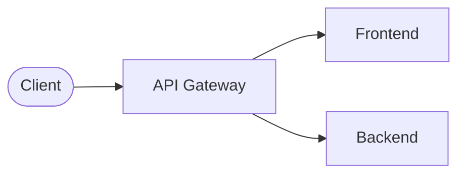

# Overview

The `Anzeigen Portal` is a web-application created with the [reference architecture](https://refarch.oss.muenchen.de/) of it@m (also referred to as "RefArch")
It's based on [Spring](https://spring.io/) as backend framework and [Vue.js](https://vuejs.org/) as frontend framework.

This website contains some basic documentation for about the general structure of this web-application.

The following sections further describe the features, architecture and its involved components.

## Features

Generally speaking this web application was heavily inspired by modern plattforms like eBay or Kleinanzeigen.
It overs a very simple and easy way to publish and discover ads for selling, buying or renting items.

Anzeigen Portal focuses on simplicity, offering a streamlined way to create and discover classified ads without handling payment processes.
This web app provides an easy platform for users to offer or find items.

When creating ads, users can include a title, category, description, images, and other attachments.
Contacting the seller is possible via an email address or phone number provided in the ad.
Ads automatically become inactive after a configurable period and are deleted after another set period.
The ad creator can extend the ad's duration and modify any aspect of it at any time.

Users browsing the ads can refine their search using categories, ad types, and text searches.
All details of an ad can be viewed on a dedicated detail page after selection.

For site administration, there is an admin area where category names can be edited, new categories added, or old ones deleted.
Ads in a deleted category are automatically moved to a Standard category, which cannot be deleted.
Additionally, configurations regarding terms and conditions, privacy files, ad duration, and the size of attachments or title images can be managed.
An info message for all users can also be displayed on the homepage.

## Architecture

The Anzeigen Portal is a microservice-based architecture where each service can be scaled and developed independently.
Following up is a description of the different components and a visualization of the connections between them.

This web-application uses an API gateway in front of the frontend (served by a webserver) and the backend component.

### API Gateway

The API gateway is not included in this project and is a ready-to-use component, which can be found [here](https://github.com/it-at-m/refarch).
It manages all requests and routes them to the respective development components like frontend and backend.
Besides that, it also handles cross-cutting concepts like authentication using a SSO, which is mandatory for this application!
Further documentation can be found [here](https://refarch.oss.muenchen.de/gateway.html).

### Components

This web-application consists of two components (frontend and backend).
Further information on the structure can be found in the respective chapters.

- **[Frontend](/frontend)**: The frontend provides the application UI and is developed with Vue.js. It calls the backend (via the API gateway) for reading and modifying data.
- **[Backend](/backend)**: The backend provides a REST-API for reading and modifying application data, handles business logic and access to databases.
